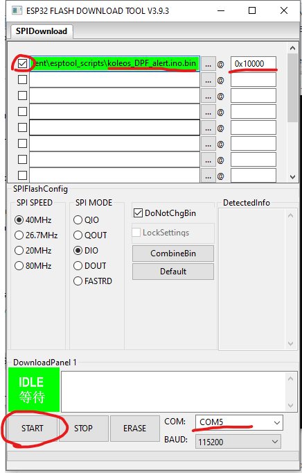

**koleos_DPF_alert.bin** is a proprietary ESP32 binary application designed for Renault Koleos GEN1 (2007 - 2016) 2.0L dCi 4WD variant. It reads DPF data and notifies the owner when a DPF regeneration begins and ends. This repository is for distribution purposes only.

# WARNING! "DPF Notifier for Koleos" and "Koleos DPF Spotify Bridge" apps are useless without the DONGLE!

# What is the DONGLE and what does it do?
1. The DONGLE is a ESP32 mounted on a PCB with some additional ICs. 
2. This dongle connects to your Renault Koleos GEN1 (years 2007-2016 2.0 dCi 4WD variant) OBD2 port and reads DPF relevant data and determines if a DPF regeneration event begins or ends. 
3. The dongle alerts the owner using a buzzer (it does NOT need the additional android apps to trigger alerts with the buzzer). 
    - Six(6) short beeps(0.1 seconds beep followed by 0.1 seconds pause) means a DPF regeneration started.
    - Three(3) long beeps (0.5 seconds beep followed by 0.5 seconds pause) means the DPF regeneration ended.
4. Additionally, you can get the "DPF Notifier for Koleos" app from Google Play which will push notifications on your android phone/tablet. More info about this app, below.
5. If you use Spotify to play songs in your Koleos, you can get the "Koleos DPF Spotify Bridge" app which will show the currently playing spotify song on the "DPF Notifier for Koleos" app screen. More info about this app, below.

# Making the dongle:
- If you want to buy the dongle, send me an e-mail casianb3@gmail.com and maybe we can work something out.
- If you want to build your own dongle, I've provided the electrical schematic (look into the 'schematic' folder). You must flash the "koleos_DPF_alert.bin" to the ESP32.

# Guide how to flash binary file to the ESP32: 
1. Follow this guide https://docs.espressif.com/projects/esp-test-tools/en/latest/esp32/production_stage/tools/flash_download_tool.html
2. Configure as in picture and press START: 

# Apps for the dongle:
- Since the esp32 has bluetooth capabilities, I've also developed "DPF Notifier for Koleos" app and "Koleos DPF Spotify Bridge" app for the dongle. (TODO add more info, pictures, yt video links, etc)

1. "DPF Notifier for Koleos" app:
- It connects to the dongle using BLE. 
- It receives data about DPF regeneration start and end from the dongle, and shows this information on the screen.
- This app runs in background, so you will receive notifications even if the phone/tablet is locked or the app is closed.
- To completely close the app, use the 'Exit App' button inside the notification or the 'Exit App' button inside the app. If you don't use these buttons, the app will continue to run in the background (you will know if the app is running in background by looking at your notifications. If the app's notification is present it means the app is running)
- The app also provides the 4WD Solenoid Current in a graph, so you can see the 4WD System behavior in whatever driving conditions.
- The app logs and stores the DPF regeneration events in memory, so you can review when they happened.
- If your device allows it, you can use "DPF Notifier for Koleos" app in split screen.

2. "Koleos DPF Spotify Bridge" app:
- It connects to the dongle using BLE.
- It pulls song information from Spotify and routes it to the dongle, then the dongle routes it to the "DPF Notifier for Koleos" app. This allows the following scenario: "Koleos DPF Spotify Bridge" app runs on your phone that plays music, and "DPF Notifier for Koleos" app runs on the car's android tablet.
- The app also runs in background and can only be closed by using the "Kill App" button inside the app.

* I personally use this scenario:
- On my phone (that has internet and spotify), I use both apps ("DPF Notifier for Koleos" and "Koleos DPF Spotify Bridge"). "DPF Notifier for Koleos" is used without the 4WD graph because it saves BLE bandwidth. 
- I use "DPF Notifier for Koleos" on my phone too to get notifications on my phone too, not just on my car's tablet.
- On my car's tablet, I only use "DPF Notifier for Koleos" with 4WD plot enabled.
- The tablet in my car turns off when I turn the car off. So after starting the car, the tablet starts and to start the "DPF Notifier for Koleos" I use macrodroid app. You can use any app that is capable of autostarting apps after boot.

## ⚠️ Licensing and Usage

This binary is **not open source**. Redistribution, modification, commercial use, or reverse engineering is **strictly prohibited** without prior written consent.

See [LICENSE](./LICENSE) for more details.

## 🔗 Third-Party Acknowledgments

This project integrates the [NimBLE-Arduino](https://github.com/h2zero/NimBLE-Arduino) library, licensed under the Apache License 2.0. See [NOTICE](./NOTICE) for attribution and license terms.

